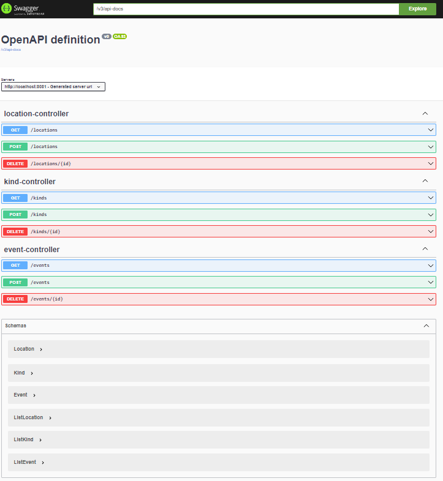

# Event Metastore
Simple store for metadata of events, exposed by a Spring API and manageable with a web app. Written with Scala and Svelte.

## API
Swagger documentation is reachable via `http://localhost:8081/swagger-ui/index.html`:

### Deploy
- Navigate into the `server` directory
- Set up a PostgreSQL database
- Make sure to configure the `application.properties` file with the corresponding credentials
- Run the maven build: `mvn clean package`
- Use the `Dockerfile` to build and run your image

## Svelte App

### Deploy
- Navigate into the `frontend` directory
- Make sure to configure the `main.js` file with the corresponding credentials (API host and token)
- Build the package: `npm run build`
- Run the `public/index.html` file locally or deploy it on any cloud platform (Vercel, Netlify etc.)
