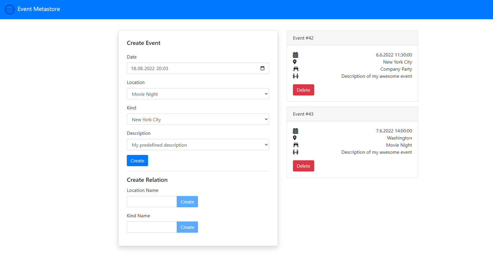

# Event Metastore

Simple store for metadata of events, exposed by a Spring API and manageable with a web app. Written with Scala and Svelte.

## Frontend

1. Navigate into the `frontend` directory
2. Configure `main.js` with the corresponding credentials (API host and token)
3. Build the package: `npm run build`
4. Run the `public/index.html` file locally or deploy it on any cloud platform

## Backend

1. Navigate into the `server` directory
2. Set up a PostgreSQL database
3. Configure `application.properties` with the corresponding credentials
4. Run the maven build: `mvn clean package`
5. Use the `Dockerfile` to build and run your image

Swagger documentation is reachable via `http://localhost:8081/swagger-ui/index.html`
